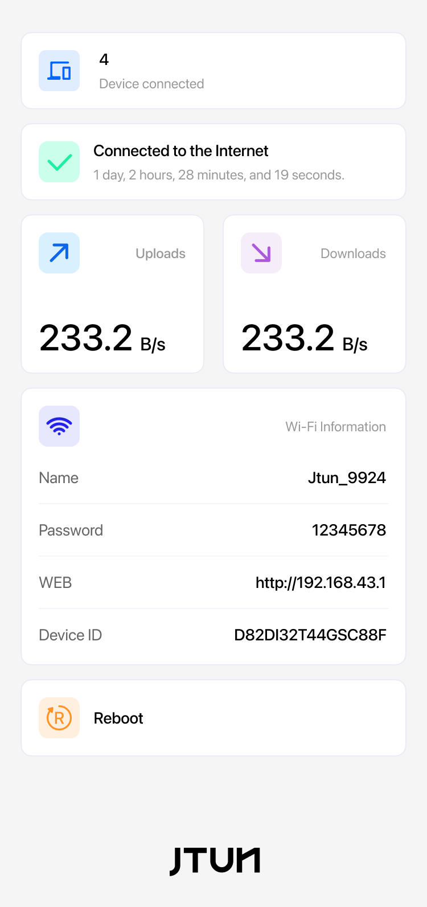
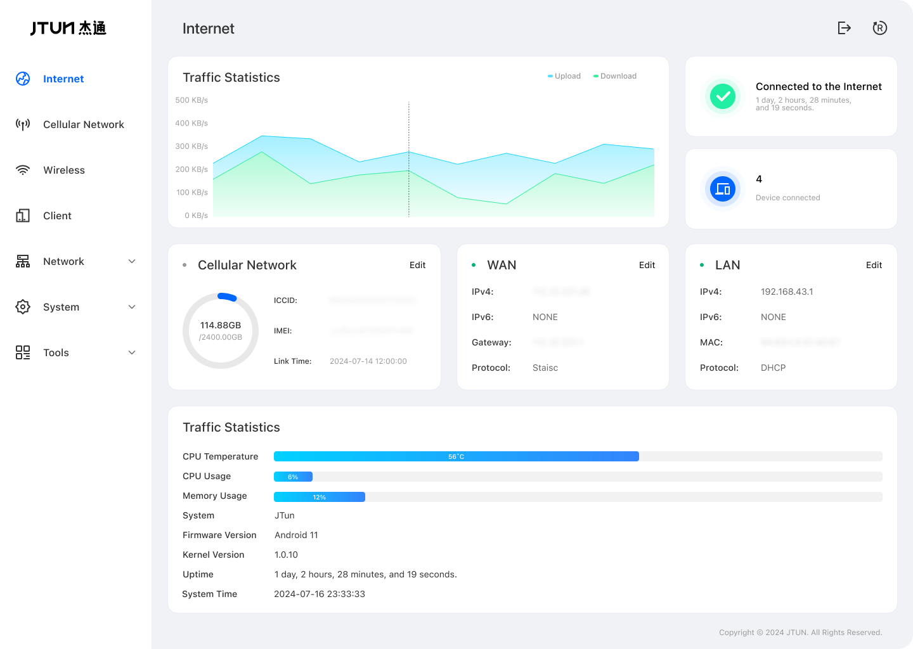
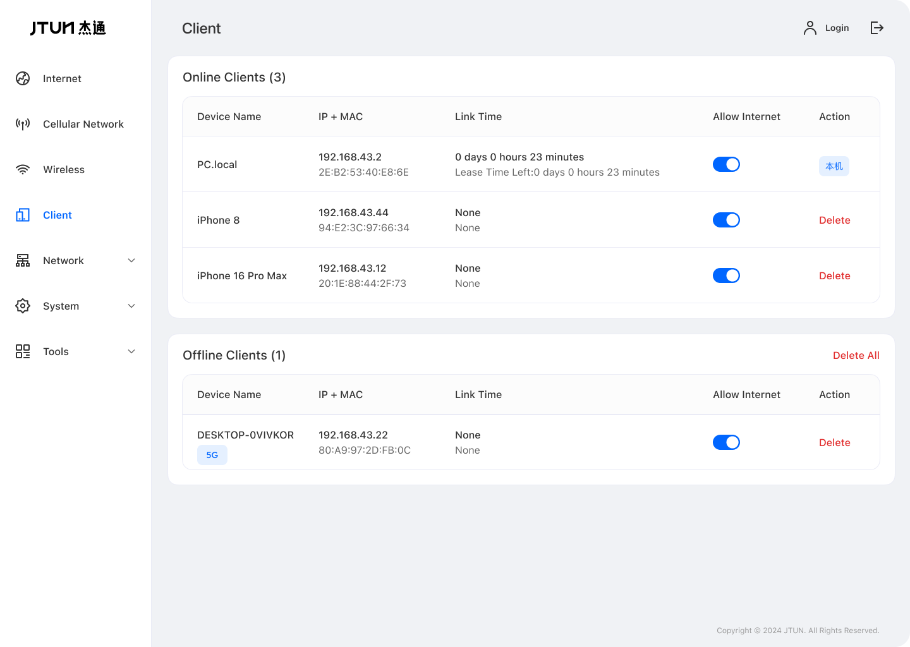
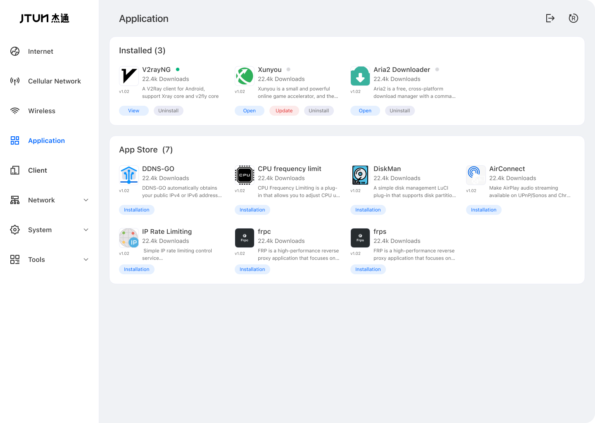
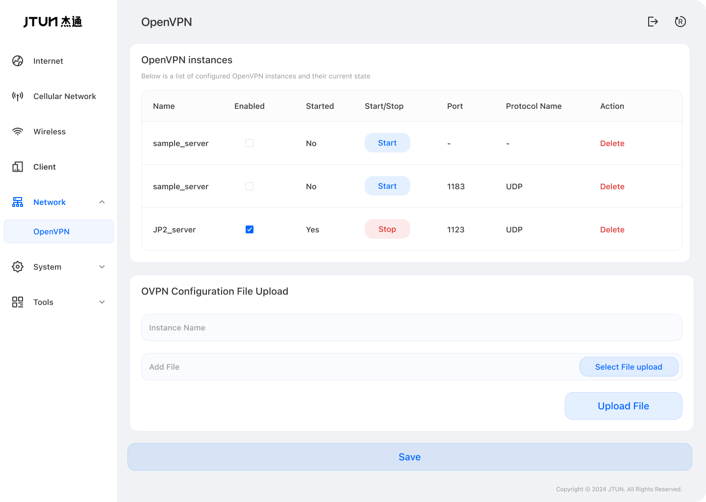
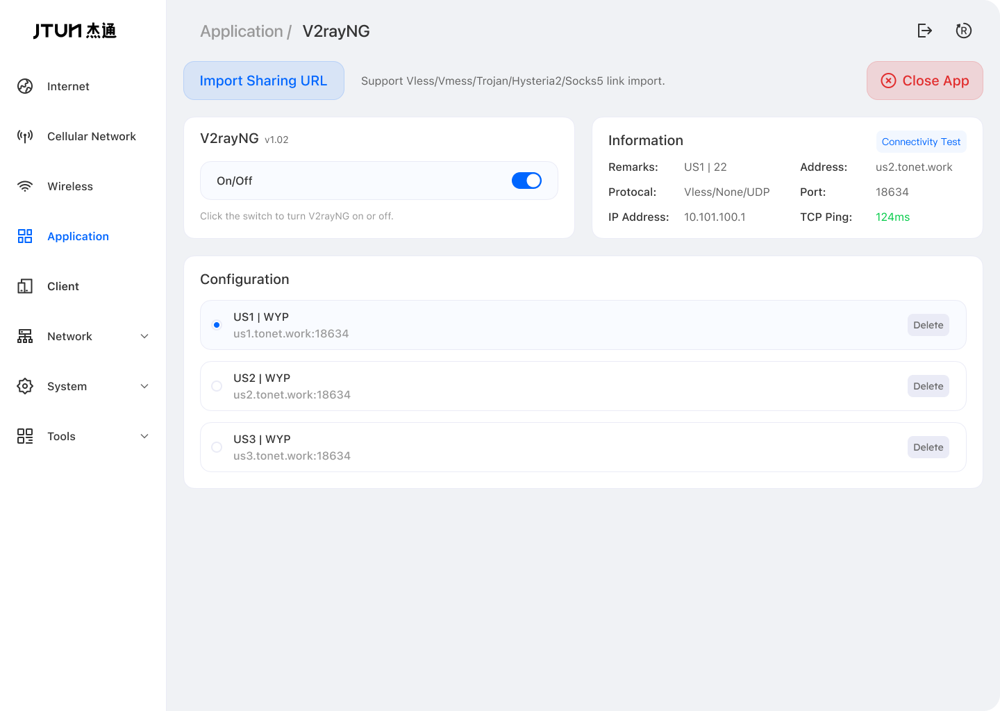
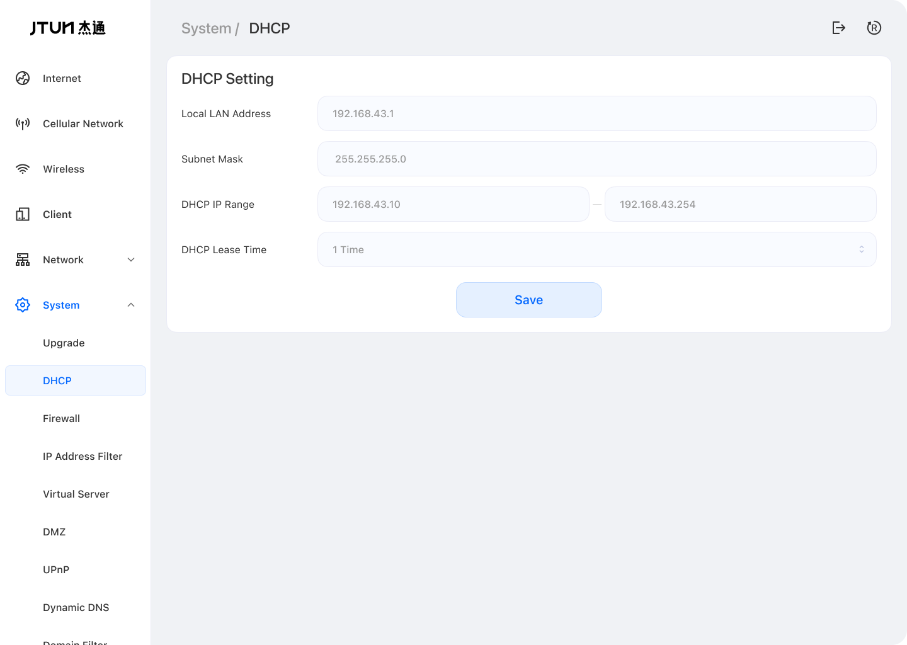
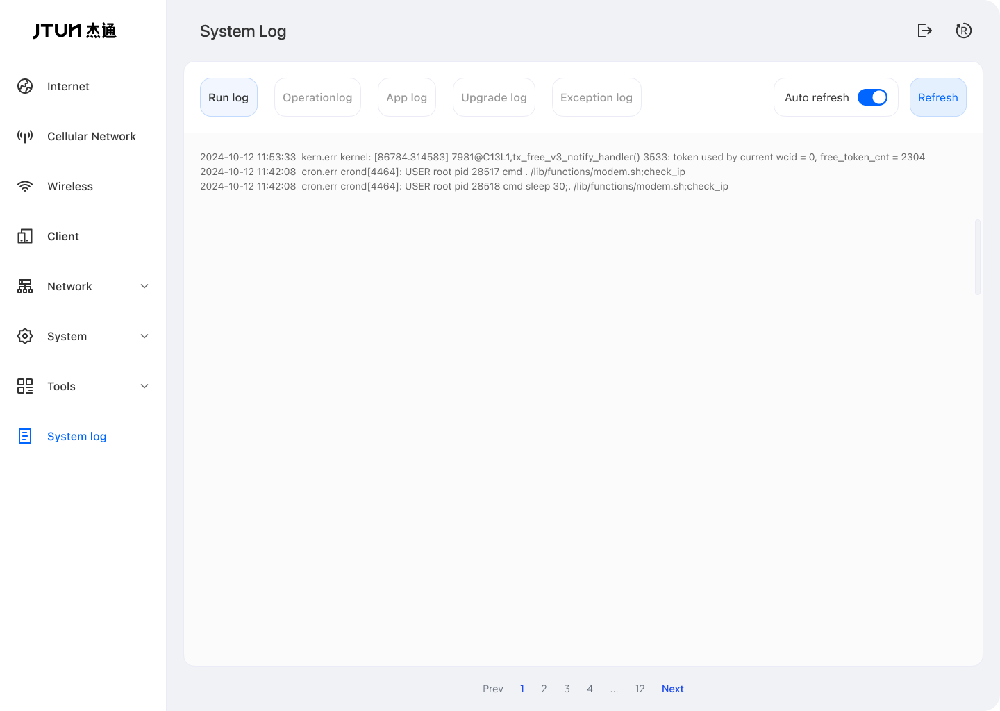
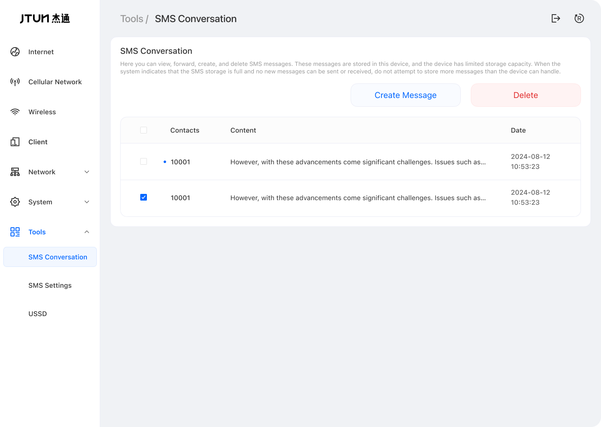

## Language

- [English](./README.md)
- [中文](./README_zh.md)

# Jtun Router

## Description

The goal of Jtun Router is to provide a network management application for Android devices that is easy to use by everyone. Whether as a mobile hotspot or a home gateway, Jtun Router offers a simple and user-friendly experience.

Leveraging the openness and versatility of Android, Jtun Router includes rich network management features, a web-based interface, and an app store. Through the web interface, users can remotely control devices and download third-party apps from the app store to enable their configuration and launch. Jtun Router ensures global connectivity with minimal barriers.

## Device Features

1. **APK Store**: Jtun Router includes an app store that integrates common APKs, allowing users to easily manage and operate apps through a straightforward interface.
2. **Firmware Upgrades**: Upgrading the firmware retains current configurations, eliminating the need to reinstall APKs after updates.
3. **App Updates**: All APKs integrated into the app store can be updated online to the latest versions.

Jtun Router simplifies interactions significantly, making it accessible even for users with no technical background. A one-click installation and setup process ensures a seamless experience.

## Jtun Router Interface Overview

## Supported Hardware

- **Android Version**: Devices running Android 5.0 and above
- **RAM**: Minimum 1GB
- **ROM**: Minimum 8GB

## Compatibility

The project integrates [VPNHotspot](https://github.com/Mygod/VPNHotspot) to easily connect to your VPN. Share your VPN connection through hotspots or repeaters (root required).

#### ROM

For testing and stability, the application runs on a modified system based on [LineageOS 18.1](https://lineageos.org/).

Online ROM downloads (more devices are being adapted):
- [Mi4](https://drive.google.com/drive/folders/1WAFptXNIyNS3VZezOFzByYu-OOs6JXFj?usp=sharing)
- [Mi5](https://drive.google.com/drive/folders/1PbkI5I_Fz7TFMVUwetMjaiu0UnzVOCKy?usp=sharing)

### Installation

Download the [app-release.apk](https://github.com/jtun-coder/JtunRouting/releases) and install it on your Android device. Launch the app and grant the necessary permissions.

## Support

- Email: [jtun@86.ltd](mailto:jtun@86.ltd)

## Join the Group

