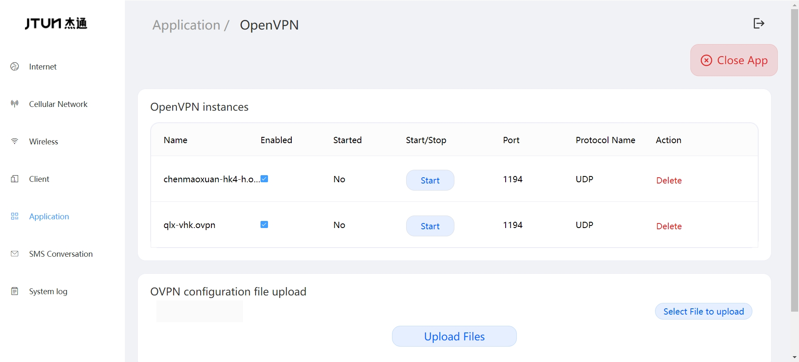
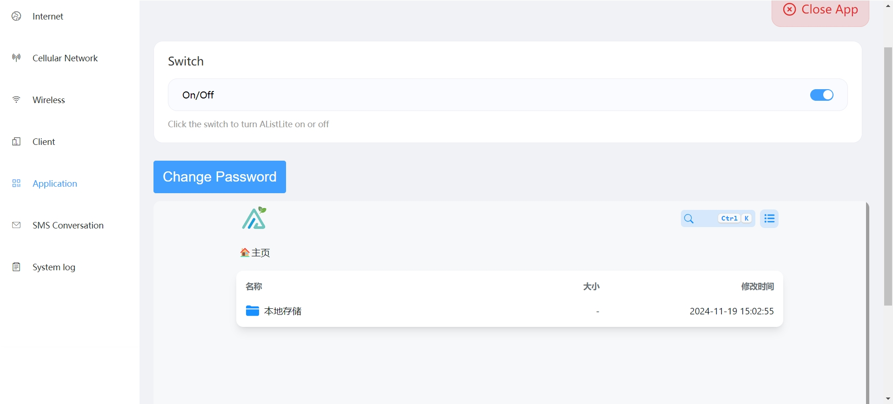
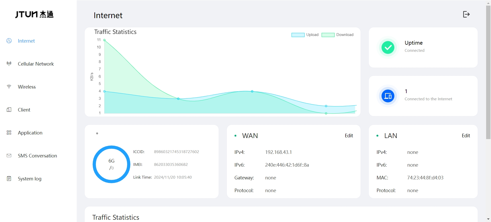
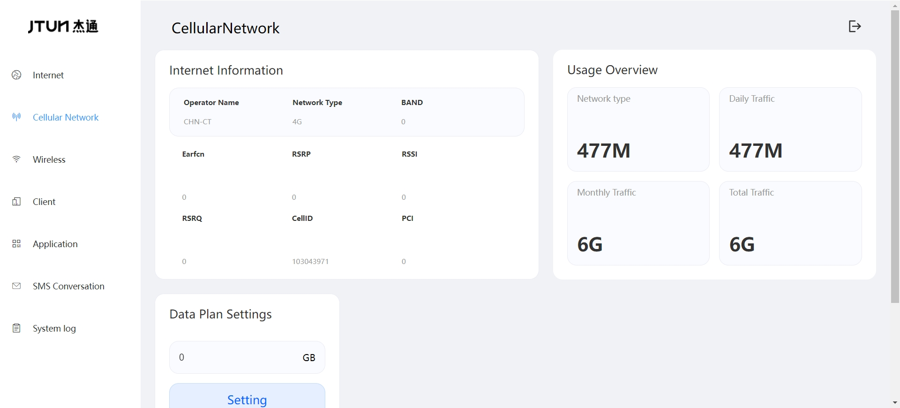
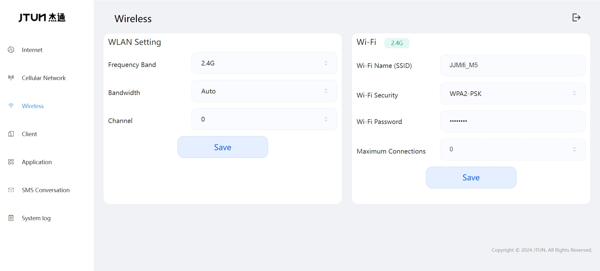
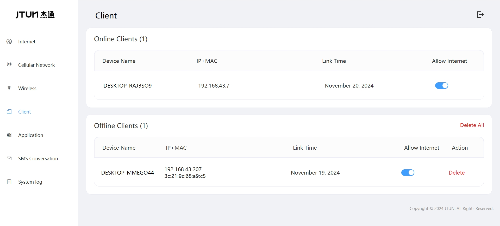
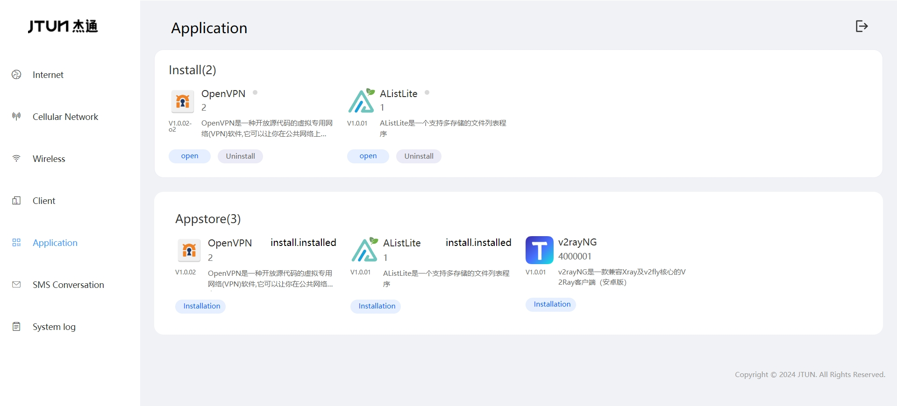
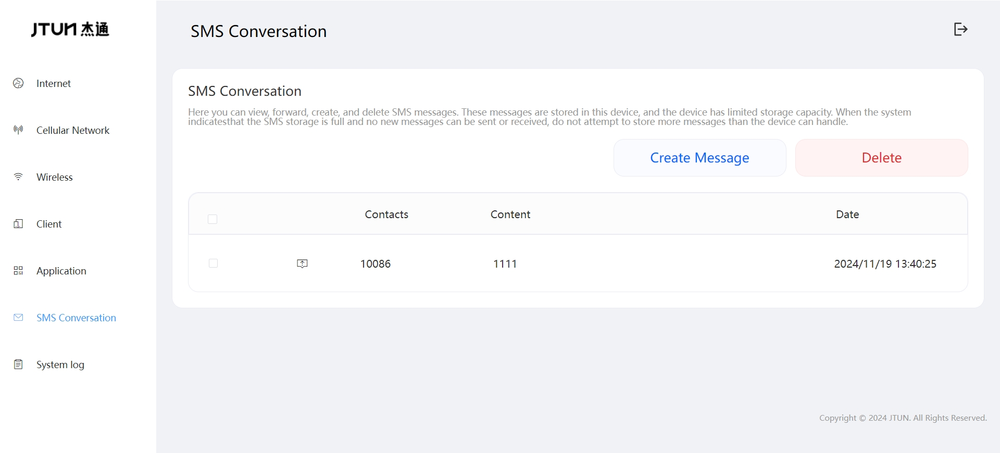

JtunRouter
=============

Description
------------
[JtunRouter](https://github.com/jtun-coder/JtunRouting) It is an Android-based application that enables managing hotspot properties through a web interface, providing mobile routing functionality.
Users can manage the device remotely via the management page without needing to operate the screen, enabling access to an app store and management of third-party applications.
Adapt to simple configuration, startup and other functions.

[OpenVPN]()

[AndroidAList]()

[V2rayNG]()

### Web operate

Compatibility
-------------
Project Integration [VPNHotspot](https://github.com/Mygod/VPNHotspot) Easily connect to your VPN. Share your VPN connection via hotspot or repeater. (Root required)

### Rom
For ease of testing and stability, the application runs on a modified system based on [LineageOS 18.1](https://lineageos.org/).

Online Rom download(The project has been integrated into the system)
[mi4](https://drive.google.com/drive/folders/1WAFptXNIyNS3VZezOFzByYu-OOs6JXFj?usp=sharing)

[mi5](https://drive.google.com/drive/folders/1PbkI5I_Fz7TFMVUwetMjaiu0UnzVOCKy?usp=sharing)
### Install

Download [app-release.apk](https://github.com/jtun-coder/JtunRouting/releases) and install it on your Android device, then launch it and grant necessary permissions.

# Support

Email: <jtun@86.ltd>