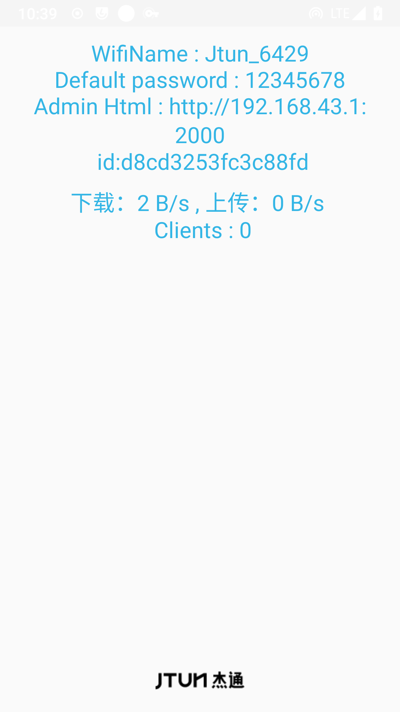

JtunRouter
=============
## Language

- [English](./README.md)
- [中文](./README_zh.md)

描述
------------
[JtunRouter](https://github.com/jtun-coder/JtunRouting) 是一款基于Android的应用程序，可通过Web界面管理热点属性，提供移动路由功能。
用户无需操作屏幕，即可通过管理页面远程操控设备，并下载应用商城三方应用，实现对第三方应用的启动和配置功能。

[OpenVPN]()

[AndroidAList]()

[V2rayNG]()

### 网页操作

兼容性
-------------
项目集成 [VPNHotspot](https://github.com/Mygod/VPNHotspot) 轻松连接到您的 VPN。通过热点或中继器共享您的 VPN 连接。（需要 Root）

### Rom
为了便于测试和稳定性，该应用程序在基于[LineageOS 18.1](https://lineageos.org/) 修改的系统上运行。

在线 Rom 下载（该项目已集成到系统中,更多设备适配中...）
[mi4](https://drive.google.com/drive/folders/1WAFptXNIyNS3VZezOFzByYu-OOs6JXFj?usp=sharing)

[mi5](https://drive.google.com/drive/folders/1PbkI5I_Fz7TFMVUwetMjaiu0UnzVOCKy?usp=sharing)
### 安装

下载 [app-release.apk](https://github.com/jtun-coder/JtunRouting/releases) 并将其安装在您的 Android 设备上，然后启动它并授予必要的权限。

# 支持

Email: <jtun@86.ltd>

# 加入群组

