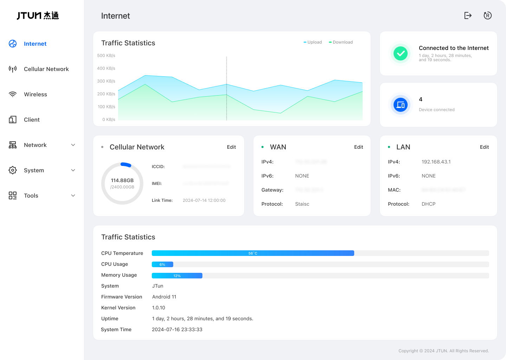
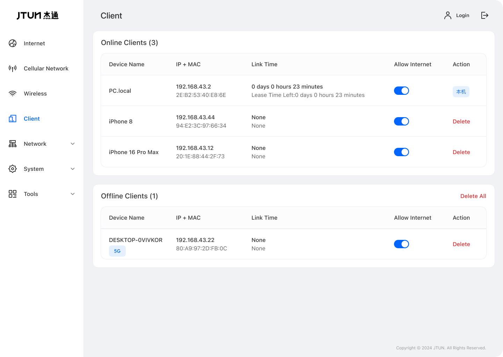
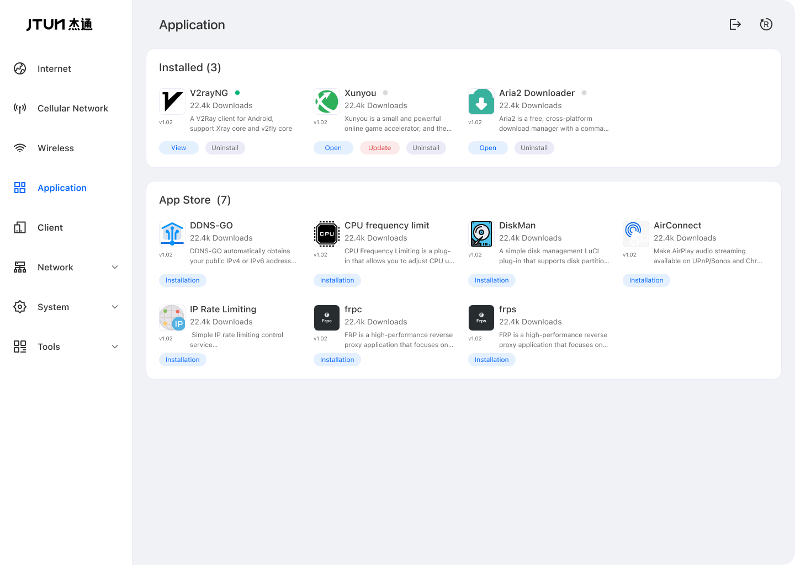
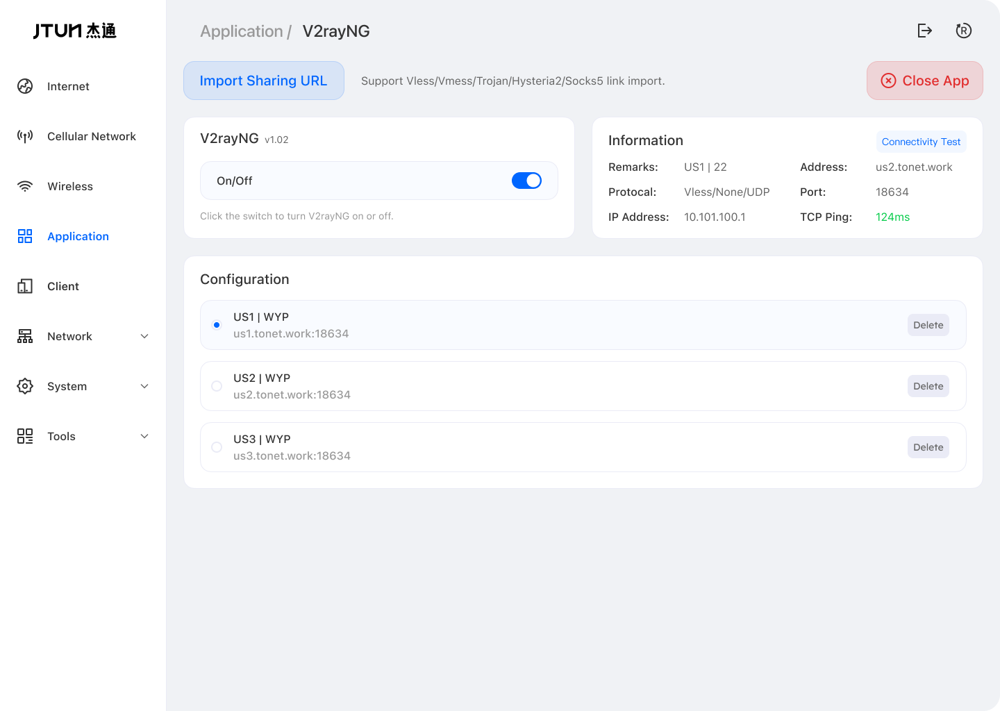
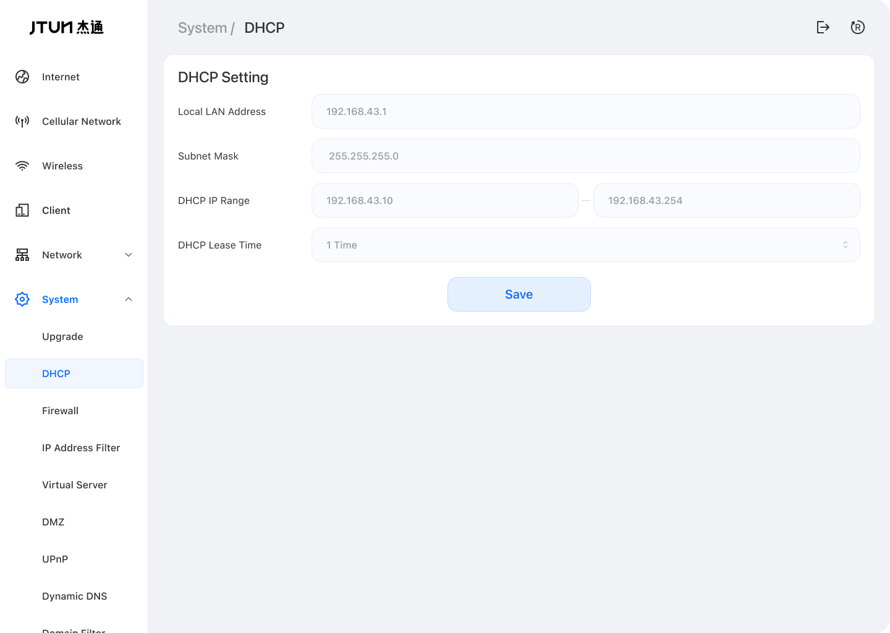
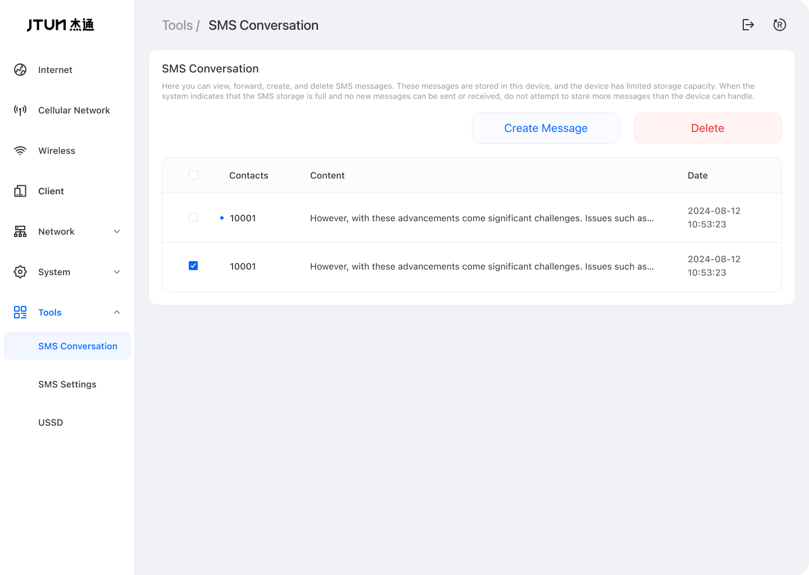

## Language

- [English](./README.md)
- [中文](./README_zh.md)

# Jtun Router

## 描述

JtunRouter 目标是提供一个人人可用的安卓设备网络管理的应用，不管是作为移动热点或是家庭网关，都有简单易上手的操作体验。

基于Android的的开放性和可玩性，JtunRouter包含丰富的网络管理、WEB界面管理、应用商店等功能。通过WEB界面远程操控设备，并下载应用商店内三方应用，实现对第三方应用的启动和配置功能。以极小的门槛全球互联。

## 设备端

1. Jtun Router 提供了应用商店：APK Store，尽可能的集成常用APK，可以让大家通过简单易上手的界面操作App
2. Jtun Router 固件升级会保留当前配置，避免升级后需要重新安装APK。
3. Jtun Router 应用商店集成的APK都可以在线升级到最新版本。

##### Jtun Router 做了很多交互向简化，使得更易上手和调试，即便是无基础也可一键安装上手并使用。

## Jtun Router 界面概览

## 支持硬件

- **Android 版本**： 5.0 以上设备
- **RAM** ：最小 1G
- ROM：最小 8G

## 兼容性

项目集成[VPNHotspot](https://github.com/Mygod/VPNHotspot)轻松连接到您的 VPN。通过热点或中继器共享您的 VPN 连接。 （需要root）

#### Rom 只读存储器

为了便于测试和稳定性，该应用程序在基于[LineageOS 18.1 的](https://lineageos.org/)修改系统上运行。

在线Rom下载(项目已集成到系统中，正在适配更多设备...) 

[mi4](https://drive.google.com/drive/folders/1WAFptXNIyNS3VZezOFzByYu-OOs6JXFj?usp=sharing)

[mi5](https://drive.google.com/drive/folders/1PbkI5I_Fz7TFMVUwetMjaiu0UnzVOCKy?usp=sharing)

### 安装

下载[app-release.apk](https://github.com/jtun-coder/JtunRouting/releases)并将其安装在您的 Android 设备上，然后启动它并授予必要的权限。

## 支持

邮箱： [jtun@86.ltd](mailto:jtun@86.ltd)

## 加入群组

